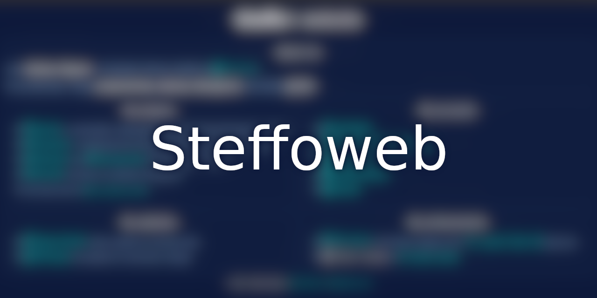

# 

My personal website in [React](https://reactjs.org/).

## Developing

### Running a local copy

If for whatever reason you want to run a local copy of the website, ensure [the latest `nodejs`](https://nodejs.org/it/) and `yarn` are installed on your 
machine, then run:

```bash
git clone https://github.com/Steffo99/steffoweb.git
cd "steffoweb"
yarn
yarn run dev
```

### Updating the website

The website will automatically update based on the `master` branch.