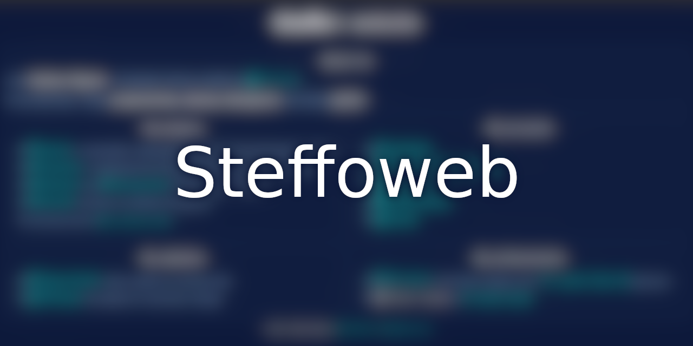

# 

My personal website in [Preact](https://preactjs.com/).


## Developing

### Running a local copy

If you want to run a local copy of the website, ensure [the latest `nodejs`](https://nodejs.org/it/) and `npm` are installed on your machine then run:

```bash
git clone https://github.com/Steffo99/uni.steffo.eu.git
cd "uni.steffo.eu"
npm install --dev
npm run start
```

### Updating the website

To update the published website, bump up the version number in the package.json and run in the previously cloned folder:

```bash
npm run all
```

[GitHub Pages](https://pages.github.com/) will do the rest.
